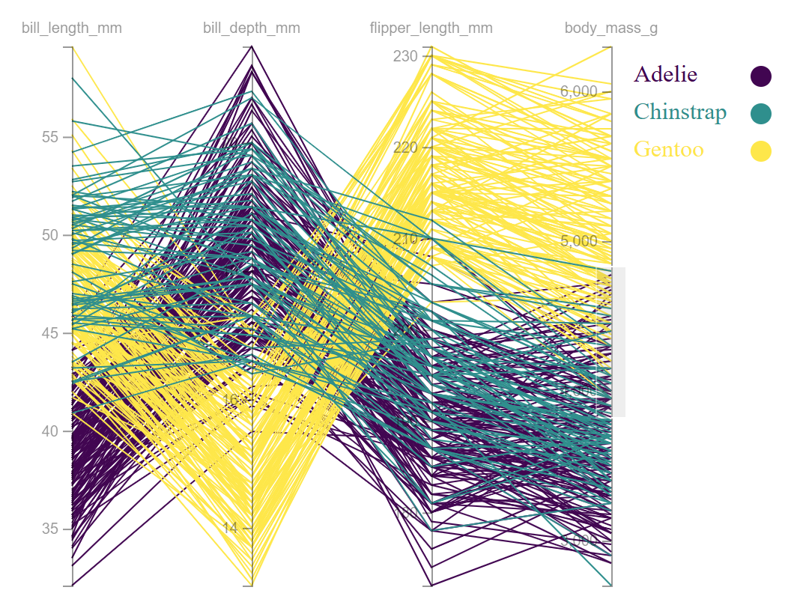
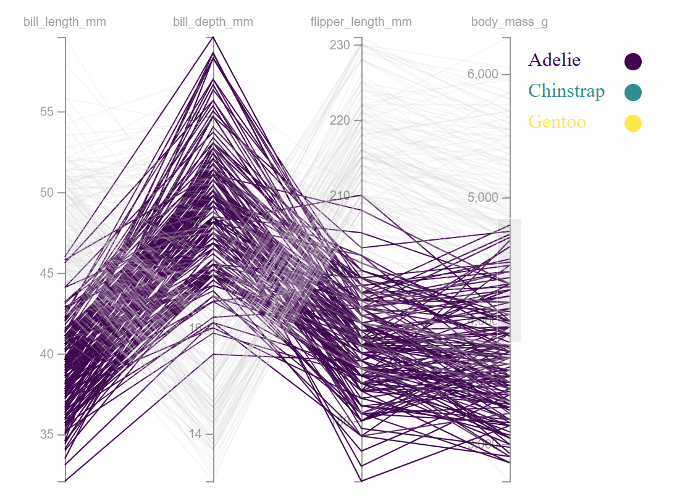
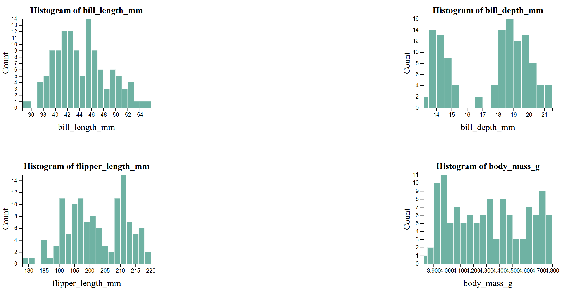
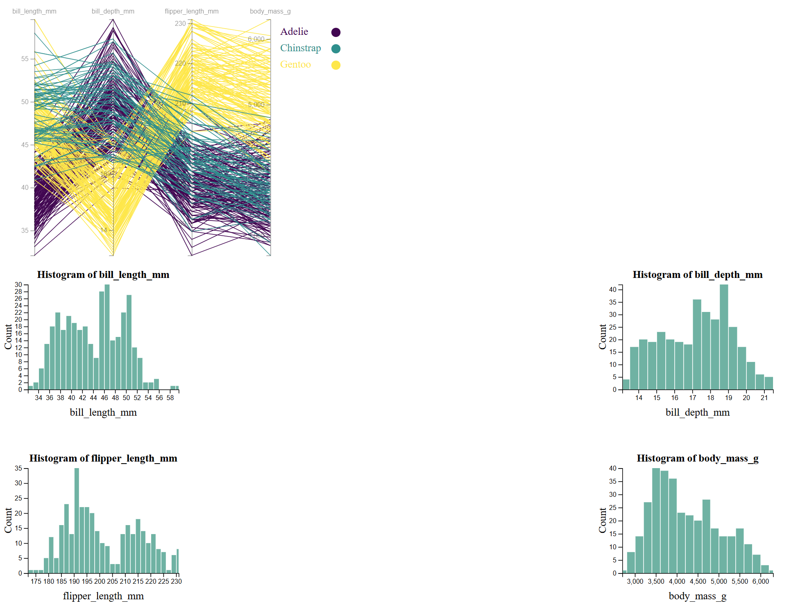
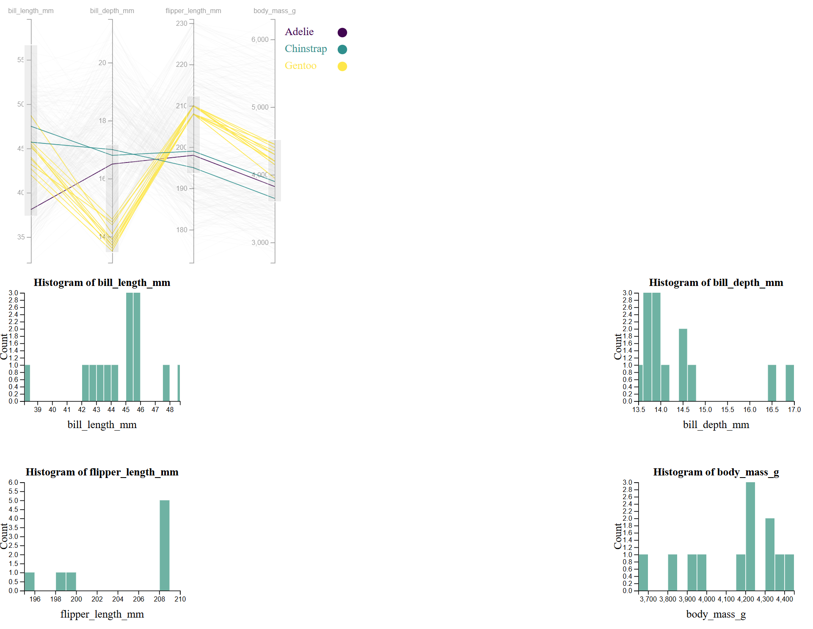

Assignment 4 - Brushing and Linking
===

## Link to vis
https://morganvazy.github.io/a4-linkedviews/a4-linkedViews.html

## Parallel coordinates chart and histograms for the Penglings dataset
For Assignment 4, I decided to model the penglings dataset again using a parallel coordinates chart and histograms. The parallel corrdinates chart have four vertical axes: bill_length_mm, bill_depth_mm, flipper_length_mm, and body_mass_g. The penguin species is also color encoded on this graph with a key to the right side.

Static image of parallel coordinates chart with key.

Hovering over a species in the parallel coordinates chart grays out all paths except for the current species being highlighted. Additionally, hovering over a species in the key (either the circle or the text) also grays out all paths except for those belonging to the specie.

Static image of hovering over key to highlight one penguin species.

Below the parallel coordinates chart, there are four histograms that show distributions for bill_length_mm, bill_depth_mm, flipper_length_mm, and body_mass_g. When first opening the visualization, the histograms show distributions for the entire dataset.

Static image of histograms upon entering the visualization.

The parallel coordinates graph and the histograms are linked by a brushing feature on the parallel coordinates graph. When brushing the vertical axis of the parallel coordinates, only paths that fit the selected conditions will be highlighted and the rest will be grayed out. Additionally, this will update the histograms with the distribution for only the selected data from the brushing.

Image of parallel coordinates and histograms without brushing.

Image of the parallel coordinates and histograms after brushing.

### Design achievements
- Histograms are in a 2x2 configuration below the parallel coordinates chart
- Individualized x axis labels and title for each histogram
- Species encoded by color and legend included to highlight different species
### Technical achievements
- Designed one function that generated four histograms at once
- incorporated linkage between the legend and the parallel coordinates chart.
### Sources used
- https://d3-graph-gallery.com/graph/parallel_custom.html
- https://css-tricks.com/complete-guide-css-grid-layout/
- https://observablehq.com/@d3/brushable-parallel-coordinates
- https://d3js.org/d3-brush
- https://d3-graph-gallery.com/graph/histogram_basic.html
- https://observablehq.com/@antonbardera/multidimensional-visualization-linked-views
- https://d3-graph-gallery.com/graph/custom_legend.html
